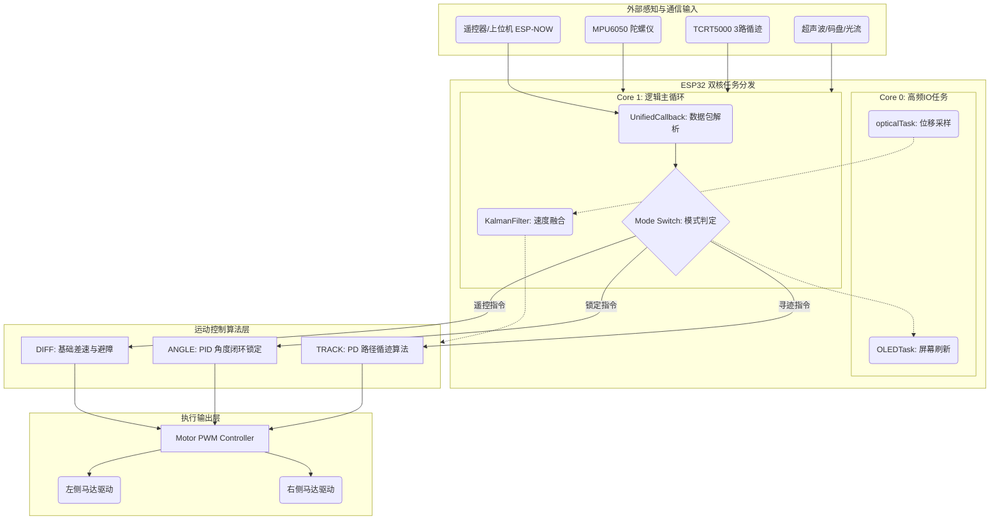

# 🚀 ESP32-SmartCar-Framework (智能小车控制框架)

[](https://www.espressif.com/en/products/socs/esp32)
[](https://en.cppreference.com/)
[]()

一个基于 ESP32 的高度解耦智能小车控制系统。本项目实现了从底层的 **PID 闭环角度控制**到上层的 **JSON 格式 MCP 指令解析引擎**的完整链路。

> **💡 说明 (Notice)**: 本项目的部分核心代码及本 Readme 文档均借助 **Gemini 3 pro** 辅助编写。

---
## 📖 快速索引
#### [🎮 指令集手册](./command.md)

---

## 🌟 技术亮点 | Key Highlights

* **异步系统架构 (Asynchronous Architecture)**: 采用 **FreeRTOS 多任务处理**，将 OLED 刷新逻辑与核心控制逻辑分离，解决复杂动作时的显示卡顿问题。
* **精准姿态控制 (Precision Control)**: 基于 **MPU6050 陀螺仪**实现的闭环转向算法，支持任意角度（如 -90°, 720°）的精准旋转。
* **多模式通讯 (Hybrid Connectivity)**: 支持 **ESP-NOW** 极低延迟遥控与 **MCP (JSON over UART/Bluetooth)** 指令控制。
* **工程化设计 (Modular Design)**: 采用 `extern` 全局状态柜模型实现模块间数据共享，代码结构清晰，易于扩展。

---

## 🛠️ 硬件配置 | Hardware Specifications

### 🏎️ 小车主体 (Car Unit)

| 模块类型 | 具体型号 | 用途描述 |
| :--- | :--- | :--- |
| **主控芯片** | ESP32-WROOM-32E (3.3V 跳线) | 核心逻辑控制与双核任务管理 |
| **陀螺仪** | 	MPU6050 陀螺仪传感器 (I2C) | 获取 Z 轴偏航角，实现角度锁定闭环 |
| **测距传感器** | HC-SR04 超声波测距 | 获取前方距离实现自动避障 |
| **光流传感器** | 优象光流 T1-001-Plus | 获取 Y 轴位移数据进行位移积分 |
| **寻迹传感器** | TCRT5000 | 3 路红外检测，实现黑色轨迹跟随 |
| **电机驱动** | TT 马达 * 2 + 万向轮 (差速转向) | 控制左右马达 PWM 调速与换向 |
| **显示屏** | OLED 128x64 | 实时显示运行状态、距离及电机速度 |

### 🎮 遥控器 (Remote Control)

| 组件         | 功能                                |
| :----------- | :---------------------------------- |
| **主控芯片** | ESP32-WROOM-32E                     |
| **输入模块** | 双轴按键摇杆 (方向) + 电位器 (限速) |
| **输出模块** | 4 位七段数码管 (显示速度等级)       |
| **通讯协议** | ESP-NOW (点对点低延迟)              |

### 🖥️ 测试端 (Test Terminal)
本工程包含一个简洁的**测试接收端** (`main_test.cpp`)
* **主要功能**：通过 ESP-NOW 接收小车回传的 `CarStatus` 结构体。
* **实时监控**：在串口监视器以 1Hz 频率格式化输出小车的坐标 (X, Y)、瞬时速度、运行模式及前方障碍物距离。
* **用途**：用于在不接 OLED 的情况下，远程调试卡尔曼滤波的收敛情况及寻迹逻辑是否正常。

---

## 📡 MCP 指令集 | Command Specification

小车支持通过串口、蓝牙或 MCP 协议解析标准的 JSON 数据包，实现自动化控制：
```json
{"cmd":"move","params":{"throttle":90,"steering":20}}
```

```json
{"cmd":"turn","params":{"turnAngle":90}}
```
---

## 📂 软件架构 | Software Architecture



---

## 📝 当前进度 | Current Progress

* [x] 基于 Z 轴的无限量程旋转算法 (支持 720° 以上旋转)。
* [x] FreeRTOS 多任务 OLED 异步刷新框架。
* [x] 全局 `extern` 状态变量共享机制。
* [x] 自动避障逻辑与休眠模式切换。
* [x] 卡尔曼滤波 (Kalman Filter) 进一步优化数据平滑度。
* [x] 指令控制小车移动固定时间和距离。
* [x] 支持无卡顿闭环控制直线行驶。
* [x] 实现低速状态下寻迹功能。
---

## 🤝 贡献与感谢

本项目是我在嵌入式开发学习过程中的实践产物。特别感谢：

* **闲趣电子-人形机器人技术社区**: 感谢老师的学习套件和Debug支持✋😭✋
* **星马梦缘**: 感谢dalao玩剩下的模块和支持✋😭✋
* **Gemini 3 pro**: 在代码架构设计、模块学习、FreeRTOS 多任务逻辑及 Readme 编写等任务上提供了重要支持。✋😭✋
